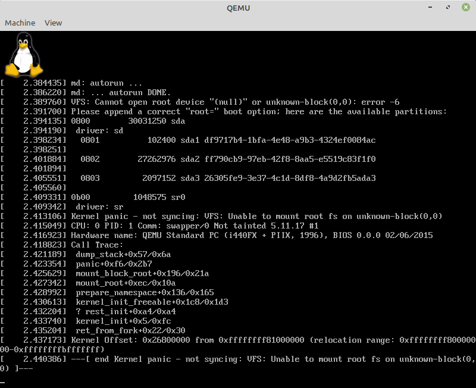

# Install Linux kernel

## Files
* boot/
  * kernel-x.y.z - Linux kernel as bzImage

## Steps
**1. Install prerequisites (Required ELF and SSL libraries)**
```
sudo apt-get install libssl-dev libelf-dev
```
**2. Download sources**
```
wget ...
```
**3. Extract archive**
```
tar ...
```
**4. Configure build**
```
cd ...
make x86_64_defconfig
```
**5. Build kernel**
```
make
```

**6. Copy kernel to Linux file system**
```
sudo cp XXX/arch/x86/boot/bzImage LINUX/boot/kernel-5.11.17
```

## Boot to kernel
```
sudo qemu-system-x86_64 -m 512M -cpu qemu64 -bios /usr/share/ovmf/OVMF.fd /dev/sda
```



Determine the partition ID of the EXT4 file system
```
sudo blkid /dev/sda2
```